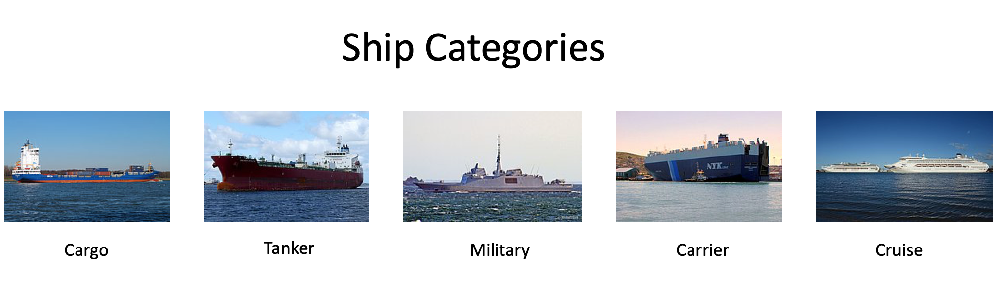

# AV-Game-of-Deep-Learning
AnalyticsVidhya- Game of Deep Learning: Computer Vision Hackathon


[Competition Link](https://datahack.analyticsvidhya.com/contest/game-of-deep-learning/)

#### Problem Statement

Ship or vessel detection has a wide range of applications, in the areas of maritime safety,  fisheries management, marine pollution, 
defence and maritime security, protection from piracy, illegal migration, etc.

Keeping this in mind, a Governmental Maritime and Coastguard Agency is planning to deploy a computer vision based automated system to
identify ship type only from the images taken by the survey boats. You have been hired as a consultant to build an efficient 
model for this project.

There are 5 classes of ships to be detected which are as follows: 



#### Dataset Description

There are 6252 images in train and 2680 images in test data. The categories of ships and their corresponding codes in the dataset are as follows -
```
'Cargo' -> 1
'Military' -> 2
'Carrier' -> 3
'Cruise' -> 4
'Tankers' -> 5
```
- There are three files provided to you, viz train.zip, test.csv and sample_submission.csv which have the following structure.

| Variable	| Definition |
| ------------- | ----------------- |
| image	| Name of the image in the dataset (ID column) |
| category | Ship category code (target column) |
 

- train.zip contains the images corresponding to both train and test set along with the true labels for train set images in train.csv

#### Evaluation Metric
The Evaluation metric for this competition is weighted F1 Score.

#### Public and Private Split
Public leaderboard is based on randomly selected 30% of the test images, while private leaderboard will be evaluated on remaining 
70% of the test images.

#### Python 3.6 libraries
```
fastai==1.0.50.post1
torch==1.0.1.post2
torchvision==0.2.2
pretrainedmodels
```

#### Approach

I have used [fastai](https://fast.ai) cnn learner datablock api. The final submission is a result of votings based on 
22 submissions which were created from 22 different models based on different techniques such as: 
 - different image size (224/499/584)
 - different pre-trained architectures (resnet101/resnet152/densenet161)
 - different augmentation techniques
 - mixup models (see the code for details) 

#### Score

- private LB score - 0.9906 (Rank - 4/2083)
- public LB Score - 0.9875 (Rank - 3/2083)


